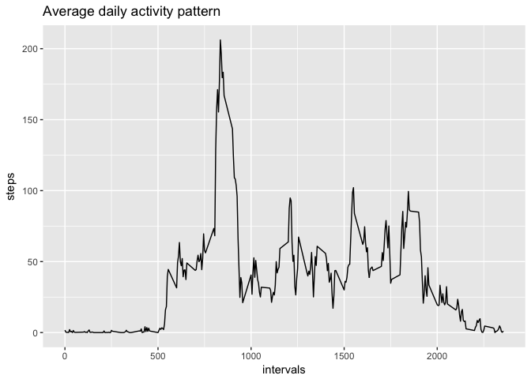

# Reproducible Research: Peer Assessment 1


This is an assignment from [Coursera's Data Science course](https://www.coursera.org/specializations/jhu-data-science), aimed to assess literate statistical programming technique using the "knitr" package. The data being used in this exercise comes from an activity monitoring device.

## Loading and preprocessing the data

If the data isn't already in the workspace, we need to load it while unzipping if necessary:


```r
if (!exists("activity")) { 
    if (!file.exists("activity.csv")){ unzip("activity.zip") }
    activity <- read.csv("activity.csv")
}
str(activity)
```

```
## 'data.frame':	17568 obs. of  3 variables:
##  $ steps   : int  NA NA NA NA NA NA NA NA NA NA ...
##  $ date    : Factor w/ 61 levels "2012-10-01","2012-10-02",..: 1 1 1 1 1 1 1 1 1 1 ...
##  $ interval: int  0 5 10 15 20 25 30 35 40 45 ...
```

The "date" variable is a Factor, but it will be more appropriate with the class Date:


```r
activity$date <- as.Date(activity$date)
```

## What is mean total number of steps taken per day?

A quick histogram can show us how the distribution of total steps per day varies:


```r
stepsPerDay <- tapply(activity$steps, activity$date, sum, na.rm=TRUE)
meanDailySteps <- mean(stepsPerDay)
medianDailySteps <- median(stepsPerDay)
library(ggplot2)
p <- qplot(stepsPerDay, binwidth=2500) + ggtitle("Total steps per day")
print(p)
```

<!-- -->

There are a large number of days (10) showing as 'lethargic', with little-to-no activity. The mean total steps per day is **9354.2295082** and the median is **10395**.

## What is the average daily activity pattern?

We can visualise the daily activity pattern using a time series plot of the 5-minute interval (x-axis) and the average number of steps taken, averaged across all days (y-axis):


```r
avgIntervalSteps <- tapply(activity$steps, activity$interval, mean, na.rm=TRUE)
avgIntervalSteps <- data.frame(intervals=activity$interval[1:288], steps=avgIntervalSteps)
q <- ggplot(avgIntervalSteps, aes(intervals,steps)) + geom_line() + ggtitle("Average daily activity pattern")
print(q)
```

<!-- -->


```r
maxAvgSteps <- which.max(avgIntervalSteps$steps)
topInterval <- avgIntervalSteps$intervals[maxAvgSteps]
topIntervalSteps <- avgIntervalSteps$steps[maxAvgSteps]
```

The 5-minute interval that, on average, has the greatest number of steps is **835** with **206.1698113** steps.

## Imputing missing values


```r
numberNAs <- sum(is.na(activity$steps))
```

There are a total of **2304** missing values in the datset. In order to impute some data to fill these gaps we will use equivalent data from the mean of that 5-minute interval across the set, and assess the difference this makes to the mean and median total daily steps.


```r
missingSteps <- data.frame(missing=is.na(activity$steps),avg=rep(avgIntervalSteps$steps, times=61))
activityFilled <- activity
for (i in 1:length(missingSteps$missing)) {
    if (missingSteps$missing[i]) {
        activityFilled$steps[i] <- missingSteps$avg[i]
    }
}
numberNAsNew <- sum(is.na(activityFilled$steps))
```

There are now 0 missing values in the new dataset.


```r
stepsPerDayFilled <- tapply(activityFilled$steps, activityFilled$date, sum, na.rm=TRUE)
s <- qplot(stepsPerDayFilled, binwidth=2500) + ggtitle("Total steps per day")
print(s)
```

<!-- -->

```r
meanNewDailySteps <- mean(stepsPerDayFilled)
medianNewDailySteps <- median(stepsPerDayFilled)
```

The new mean total steps per day is **1.0766189\times 10^{4}** and the new median is **1.0766189\times 10^{4}**. Not only has the use of equivalent averaged data reduced the number of lethargic days, the mean and median steps per day have a much smaller discrepancy.

## Are there differences in activity patterns between weekdays and weekends?

First, let's add a Factor variable to divide the data between weekdays and weekend:


```r
days <- weekdays(activityFilled$date)
for (i in 1:length(days)) {
    if (days[i] == "Saturday" | days[i] == "Sunday") {
        activityFilled$day[i] <- "weekend"
    } else {
        activityFilled$day[i] <- "weekday"
    }
}
activityFilled$day <- as.factor(activityFilled$day)
str(activityFilled)
```

```
## 'data.frame':	17568 obs. of  4 variables:
##  $ steps   : num  1.717 0.3396 0.1321 0.1509 0.0755 ...
##  $ date    : Date, format: "2012-10-01" "2012-10-01" ...
##  $ interval: int  0 5 10 15 20 25 30 35 40 45 ...
##  $ day     : Factor w/ 2 levels "weekday","weekend": 1 1 1 1 1 1 1 1 1 1 ...
```

With this new Factor variable, we can recreate the daily activity pattern using a similar time series plot, this time separating the data by weekday/weekend.


```r
newActivityPattern <- tapply(activityFilled$steps, list(activityFilled$interval, activityFilled$day), mean)
library(reshape2)
newActivityPattern <- melt(newActivityPattern)
names(newActivityPattern) <- c("intervals", "day", "steps")

t <- ggplot(newActivityPattern, aes(intervals,steps)) + facet_grid(day~.) + geom_line()
print(t)
```

<!-- -->

This appears to show that weekend activity starts later in the day, and climbs more gradually towards a smaller peak.
